

<h1>🚀 ITI Examination System</h1>

<h2 style="
background: linear-gradient(90deg, #0078D7, #FFB900);
color: white;
padding: 10px 0;
border-radius: 10px;
width: 70%;
margin: auto;
font-family: 'Segoe UI', sans-serif;
">

 

     
🧰 Technologies & Tools     
</h2>

    
## 🎯 Project Overview

This project represents a **revolutionary end-to-end solution** designed to transform how the Information Technology Institute (ITI) manages its academic operations. We're not just building a database - we're crafting a complete ecosystem that handles everything from student registration to advanced business intelligence.

  
## ⚙️ Project Workflow

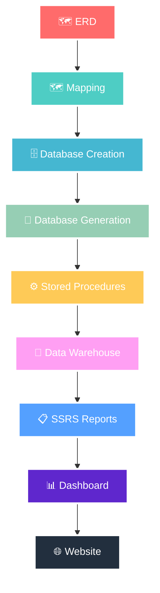

## 🗺️ ERD

  In this phase, we designed the <b>Entity-Relationship Diagram (ERD)</b> to define the main entities,
  their attributes, and the relationships between them. This step provided a clear conceptual
  view of how data flows within the system.

  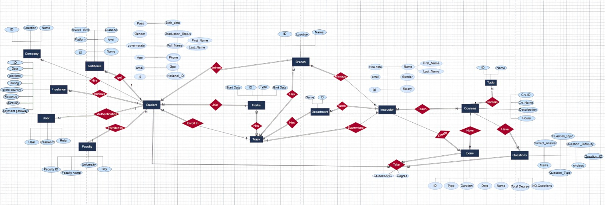

## 🗺️ Mapping

  After completing the <b>Entity-Relationship Diagram (ERD)</b>, we performed the <b>mapping process</b> 
  to translate the conceptual model into a logical database structure. This included defining 
  primary and foreign keys, establishing relationships between tables, and preparing the foundation 
  for database creation and further data modeling.

  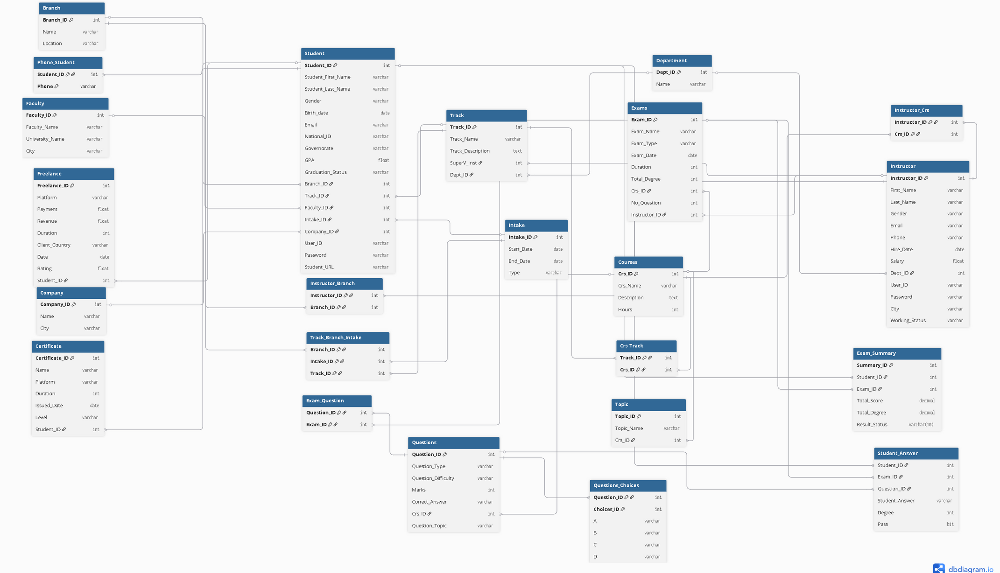

## 🗄️ Database Creation

  In this stage, we implemented the <b>database schema</b> by writing and executing the required 
  <b>SQL scripts</b>. We began by creating the database using the 
  <code>CREATE DATABASE</code> command, followed by defining tables and specifying 
  appropriate <b>data types</b> for each attribute using <code>CREATE TABLE</code>. 
  Afterward, we applied <b>constraints</b> such as <code>PRIMARY KEY</code>, 
  <code>FOREIGN KEY</code>, and <code>NOT NULL</code> to ensure data integrity and maintain 
  relationships between entities.
  Finally, the system components were integrated into a functional database environment, 
  and testing was conducted to verify that it efficiently handles exam data, student responses, 
  and related operations.

  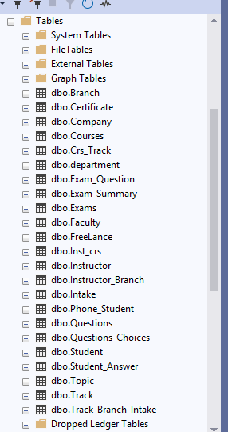

## 🧮 Database Generation

  In this phase, we utilized <b>Python</b> along with several <b>AI-powered platforms</b> 
  to generate the required dataset. Using Python libraries such as 
  <code>Faker</code> and <code>Random</code>, we created structured and diverse synthetic data 
  representing students, courses, and exam activities. 
    
  To enhance data realism and variability, we also leveraged <b>AI tools</b> like 
  <b>ChatGPT</b> and <b>Gemini</b> to simulate more complex scenarios, such as 
  realistic exam results, student behavior patterns, and course interactions. 
    
  This combination of traditional data generation techniques and AI-assisted modeling 
  allowed us to build a <b>high-quality, representative dataset</b> suitable for testing 
  and system evaluation.

  

  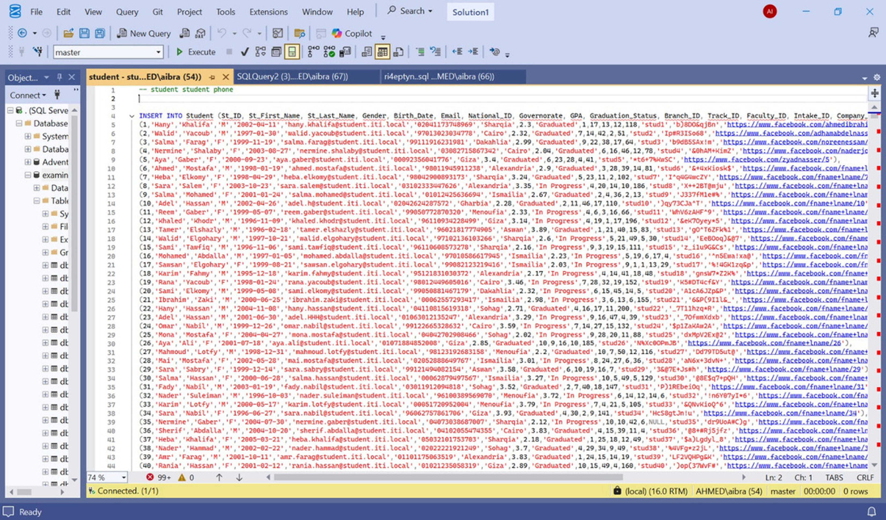

## ⚙️ Stored Procedures

  In this phase, we created stored procedures for each table in the database to 
  handle the main data operations. These procedures were developed to perform 
  Insert, Update, and Delete actions efficiently and securely. Using stored 
  procedures helped improve performance, maintain data consistency, and 
  simplify interaction between the application and the database by centralizing all 
  SQL logic in one place. 

  

## 🏢 DWH

In this stage, we built the analytical layer using <b>SQL Views</b> to serve as a 
<b>virtual data warehouse</b>. A semantic layer was designed above the operational 
database to enable analytical querying without duplicating data physically. 
All data is accessed dynamically through views, ensuring efficiency and consistency 
between the transactional and analytical systems. 
  
The warehouse follows a <b>Fact–Dimensions architecture</b> that separates 
operational details from analytical insights. The central <b>Fact_ExamActivity</b> 
view captures exam responses, marks, and results, while multiple <b>dimension views</b> 
such as <b>Students</b>, <b>Exams</b>, <b>Courses</b>, <b>Questions</b>, <b>Instructors</b>, 
and <b>Dates</b> provide contextual information. 
This design supports advanced <b>analytical queries</b>, <b>trend analysis</b>, and 
<b>KPI reporting</b> — forming a scalable and efficient analytical model for the 
ITI Examination System.

 

  

  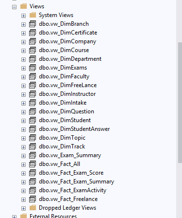

  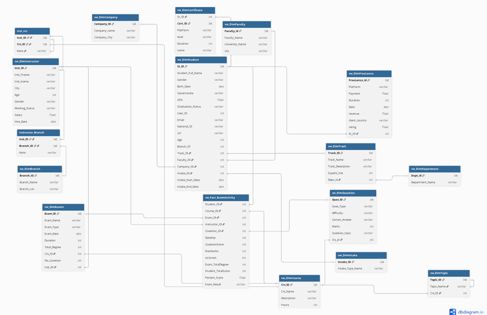

## 📋 SSRS Reports

## 📊 Dashboard

 
*Wanna see a sample of our 20+ Dashboards 📊?*

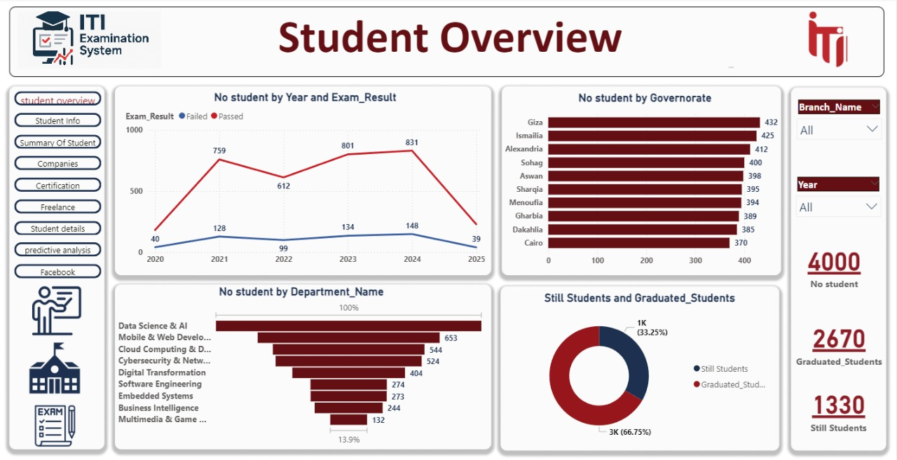
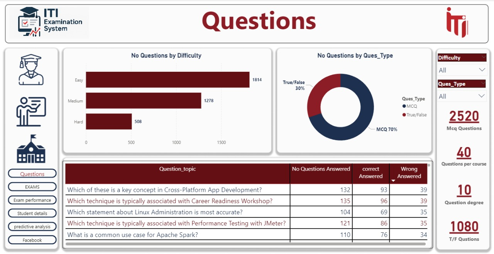
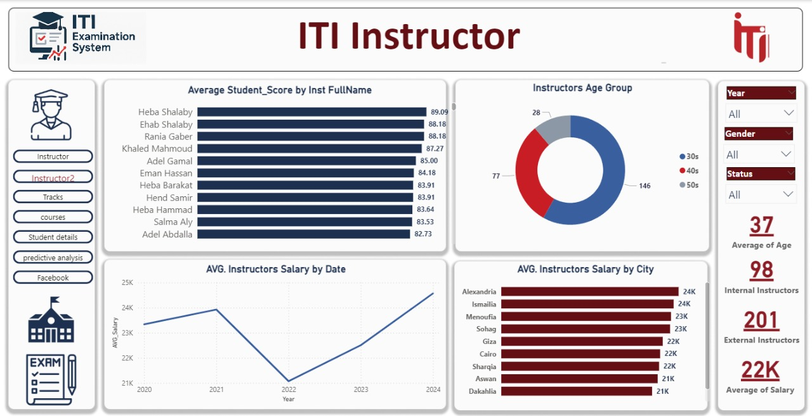
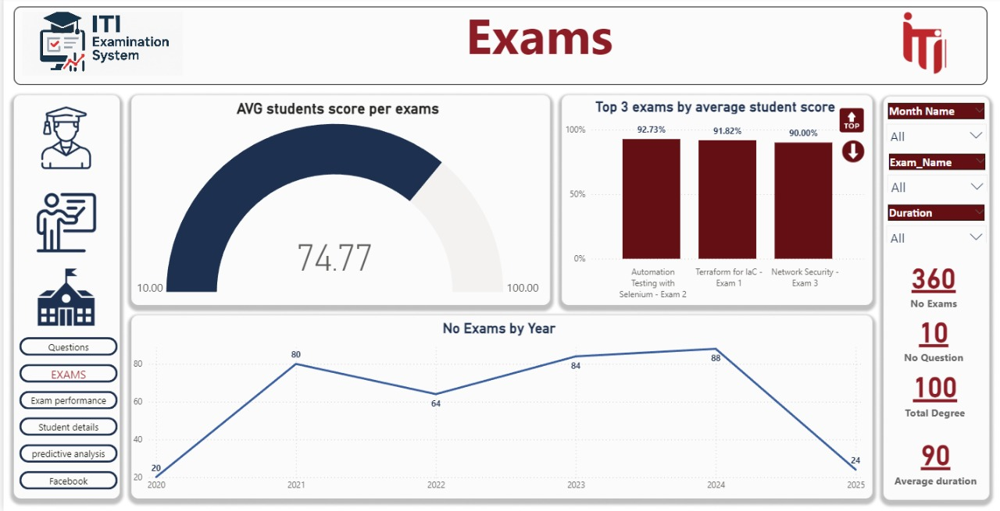

## 🌐 Website Interface

## 💻 Meet The Dream Team

<h2 style="color:#0078D7; font-family:'Segoe UI', sans-serif;">✨ The Data Dynamos ✨</h2>

<table>
<tr>

<!-- 🧠 Ziad Sharaf -->
<td align="center">

 <b>Ziad Sharaf</b> 
Data Analyst • Power BI Specialist  

</td>

<!-- ⚡ Adham Abdelnasser -->
<td align="center">

 <b>Adham Abdelnasser</b> 
Data Analyst • BI Developer  

</td>

<!-- 💎 Noreen Essam -->
<td align="center">

 <b>Noreen Essam</b> 
Data Analyst • Visualization Expert  

</td>

<!-- 🎯 Ahmed Ibrahim -->
<td align="center">

 <b>Ahmed Ibrahim</b> 
Data Engineer • BI Developer  

</td>

<!-- 🌟 Nader John -->
<td align="center">

 <b>Nader John</b> 
Data Analyst • Dashboard Creator  

</td>

</tr>
</table>

 

 

